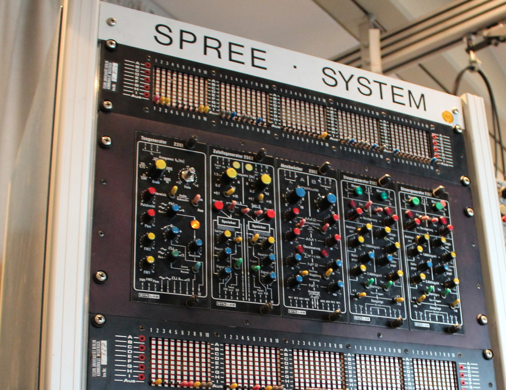

This is the accompanying repository for the TU seminar:

[Sound Synthesis: Building Instruments with Faust](https://www.ak.tu-berlin.de/menue/lehre/sommersemester_2020/sound_synthesis/)

It will be updated weekly with materials, 
including Faust code and Jupyter notebooks.

# Faust

- the _Faust_ directory holds examples for different 
  synthesis techniques in separate directories

# Jupyter

## Topics

- the _topics_ directory has subdirectories 
  with notebooks to be used be the students

## no-code-book

- the _no-code-book_ directory is used for preparing the classes
- no-code-books are converted to HTML through
pandoc 